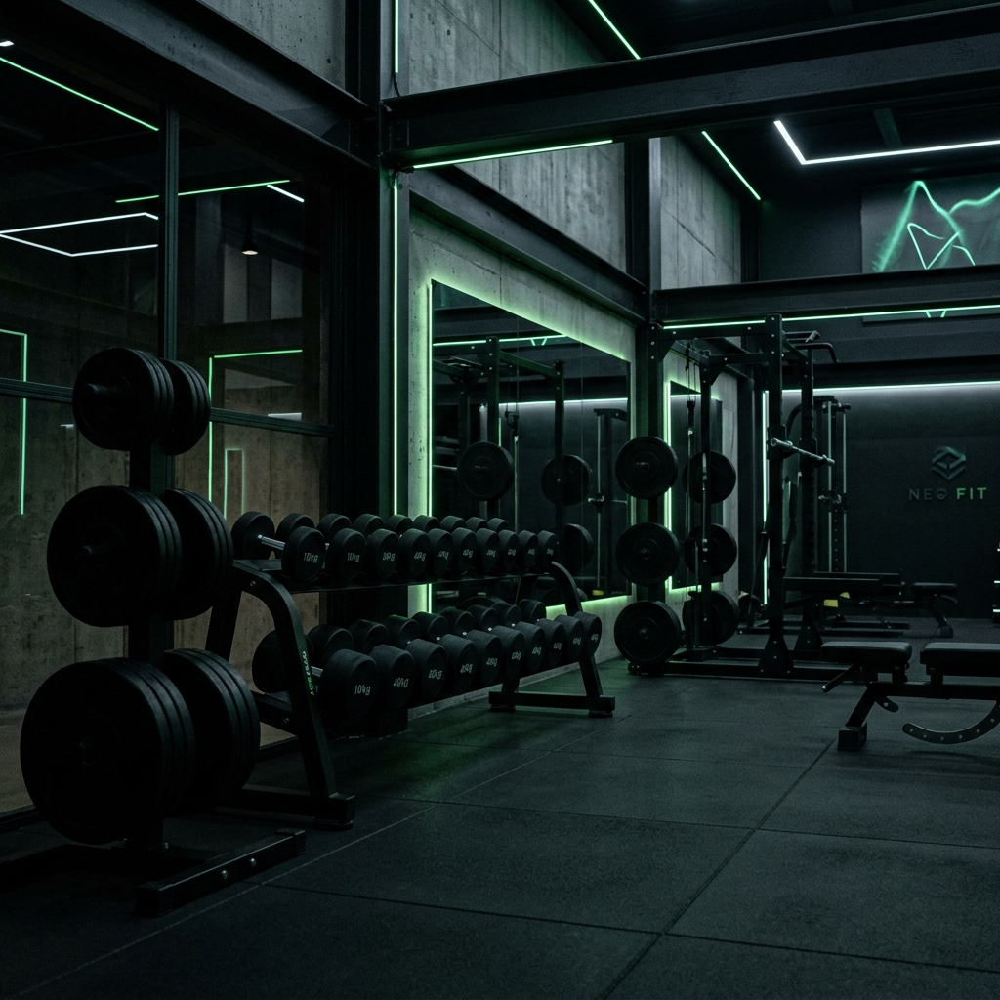

# 🏋️ Fortafyt Gym Platform



Una plataforma web integral para la gestión de un gimnasio moderno, diseñada con arquitectura **MVC en PHP puro** y un frontend elegante utilizando **Glassmorphism** y un sistema de temas (Oscuro/Claro).

## ✨ Características Principales

*   **Identidad Visual Premium**: Interfaz responsive y moderna con diseño Glassmorphism, animaciones fluidas y tipografía contemporánea.
*   **Área de Usuario Personalizada**:
    *   Generación automática de un **Pase QR único** para el acceso físico al gimnasio.
    *   **Calculadora de IMC Integrada**: Guarda el progreso del usuario y clasifica su salud mediante un sistema visual de colores.
    *   Avatar interactivo con sistema de subida de fotos (renombrado seguro y verificación de extensión).
*   **E-Commerce y Tienda**:
    *   Carrito de compras persistente gestionado mediante `$_SESSION`.
    *   Catálogo de suplementación deportiva (Creatina, Pre-Entrenos, Proteína, etc.).
*   **Sistema de Reservas**: Desplegable dinámico para reservar plazas en distintas actividades (CrossFit, Yoga, Spinning, etc.).
*   **Panel de Administración (Admin)**: Capacidad para añadir/eliminar clases y gestionar usuarios registrados.
*   **Internacionalización (i18n)**: Sistema de traducción al instante (Inglés 🇬🇧 / Español 🇪🇸) manejado a través de diccionarios JSON y Cookies.
*   **Modo Oscuro / Claro**: Persistencia visual basada en el navegador del usuario utilizando `LocalStorage` y `Cookies`.

## 🛠️ Tecnologías Utilizadas

*   **Backend**: PHP 8.x (Arquitectura MVC: Modelos, Vistas y Controladores).
*   **Frontend**: HTML5, CSS3 (Variables CSS, Flexbox/Grid) y JavaScript (Vanilla JS).
*   **Base de Datos**: MySQL (Consultas preparadas `stmt` para evitar inyecciones SQL).
*   **APIs**: Integración con `qrserver.com` para la generación de pases QR al vuelo.

## 🚀 Instalación y Uso Local

1.  **Clonar el repositorio**:
    ```bash
    git clone https://github.com/Neestor63/Proyecto_final_curso.git
    ```
2.  **Preparar el entorno**:
    *   Asegúrate de tener instalado XAMPP, WAMP o un entorno similar.
    *   Mueve la carpeta clonada dentro del directorio `htdocs` (en el caso de XAMPP).
3.  **Base de Datos**:
    *   Abre phpMyAdmin o tu consola MySQL.
    *   Crea una base de datos llamada `proyecto_reservas`.
    *   Ejecuta el script SQL (o la migración) para crear las tablas `usuarios`, `salas` y `reservas`. *(Asegúrate de incluir las columnas `peso`, `altura`, `imc` y `foto_perfil` en la tabla usuarios).*
4.  **Configuración**:
    *   Revisa el archivo `config/database.php` y asegúrate de que las credenciales (`root`, sin contraseña) coincidan con las de tu servidor local.
5.  **Ejecutar**:
    *   Inicia los servicios de Apache y MySQL.
    *   Accede en tu navegador a: `http://localhost/Proyecto_final_curso/`

## 🔒 Seguridad Implementada

*   Uso de `password_hash()` y `password_verify()` para el manejo de contraseñas.
*   Validación de tipo y peso (máximo 5MB) en la subida de fotos de perfil.
*   Protección contra inyección SQL mediante el uso intensivo de `bind_param` de MySQLi.
*   Restricción de rutas mediante comprobación de `$_SESSION['usuario_id']` y `$_SESSION['rol']`.

---
*Proyecto final desarrollado como muestra de habilidades Full-Stack en PHP.*
